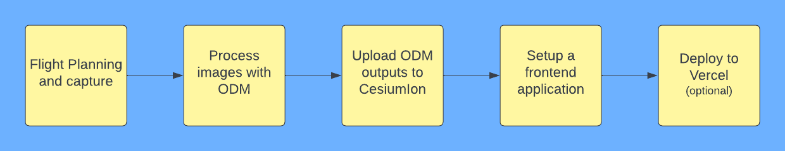

## Drone Photogrammetry

To run this code you gonna need to create a .env file with the variables present at  `environment.d.ts`. The code is pretty simple, this is more about choose the right tools to render a 3D tile in a map.

### Demo

https://drone-photogrammetry.vercel.app/